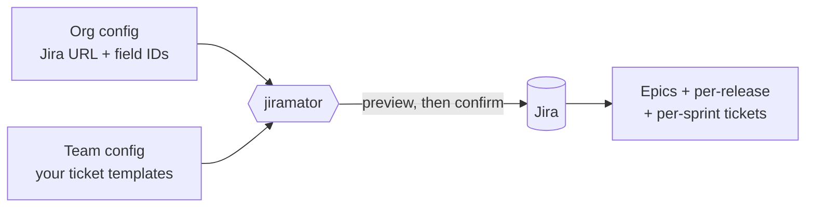

# Jiramator

**Create all your recurring Jira tickets for a Program Increment in one command,
instead of typing them in by hand.**

Every PI, teams hand-create dozens of near-identical Jira tickets: regression
tests per release, prod-support tickets per sprint, the same epics every time.
Jiramator does that for you. You describe the tickets **once** in a config file,
and Jiramator stamps out the full set — correctly linked to epics, fix versions,
and sprints — after showing you a preview first.



**Who it's for:** product owners, scrum masters, and tech leads who run PI
planning. You do not need to be a programmer. First-time setup is a guided
wizard — `jiramator init` connects to Jira, discovers your field IDs, and
writes your config for you; you just need to create a Jira API token (the
wizard links you to the page). See [Quick Start](#quick-start).

**Three things it can do:**

| Command | What it does |
|---|---|
| `plan` | Generate a whole PI's worth of epics + per-release + per-sprint tickets from templates |
| `import` | Create Jira issues in bulk from a CSV/Excel spreadsheet (e.g. risk intake) |
| `update` | Bulk-edit fields on existing Jira issues from a CSV/Excel spreadsheet |

Everything runs **preview-first**: `--dry-run` shows exactly what would happen and
touches nothing in Jira until you confirm.

> **Looking for the full config schema, template syntax, or exact flag/safety
> behavior?** That level of detail lives in the
> **[wiki](https://github.com/dkim_mktx/jiramator/wiki)**, so this README stays
> quick to scan. **Contributing to Jiramator itself?** See
> [CONTRIBUTING.md](CONTRIBUTING.md) for the developer setup and test suite.

## Glossary

New to some of the terms below? Here's what they mean in Jiramator:

| Term | What it means |
|---|---|
| **PI (Program Increment)** | A fixed planning window (often ~10 weeks / several sprints) that your teams plan work around. Jiramator generates a whole PI's worth of tickets at once. |
| **Sprint** | A short, fixed work cycle (commonly 2 weeks) inside a PI. Jiramator can stamp out one or more tickets per sprint. |
| **Epic** | A large bucket of work in Jira that smaller tickets are linked to (e.g. "BAU" or "Miscellaneous"). Jiramator can create these or reuse ones you already have. |
| **Fix version / release** | The Jira label marking which release a ticket belongs to (e.g. `26.2.1`). Jiramator can generate a set of tickets per release. |
| **Custom field ID** | Jira's internal code for a field you see by name (e.g. "Story Points" is really `customfield_10026`). The `init` wizard discovers these for you, so you never copy them by hand. |
| **API token** | A password-like key that lets Jiramator sign in to Jira on your behalf. You create one on Atlassian's site; Jiramator reads it from your environment and never stores it in a file. |
| **Dry run (`--dry-run`)** | A preview mode. Jiramator shows exactly what it *would* create or change and touches nothing in Jira until you confirm. |
| **Org config / team config** | The two YAML settings files Jiramator uses. The *org config* holds Jira-instance settings shared across teams; the *team config* holds one team's ticket templates. The `init` wizard writes both for you. |

## Quick Start

### 1. Install

**Prerequisite:** Python 3.11 or newer
([python.org/downloads](https://www.python.org/downloads/)). Check with
`python3 --version` (Windows: `py --version`).

**Recommended — install with [pipx](https://pipx.pypa.io)** (one command, no
virtual environment to manage, gives you a global `jiramator` command):

```bash
# Install pipx once (see pipx docs for your OS), then:
pipx install git+https://github.com/dkim_mktx/jiramator.git

# Verify
jiramator --version
```

<details>
<summary><b>Alternative: clone + virtual environment</b> (for development, or if you don't use pipx)</summary>

Also needs Git ([git-scm.com/downloads](https://git-scm.com/downloads)), or use
the green **Code → Download ZIP** button on the
[repo page](https://github.com/dkim_mktx/jiramator).

```bash
# macOS / Linux
git clone https://github.com/dkim_mktx/jiramator.git
cd jiramator
python3 -m venv .venv
source .venv/bin/activate
pip install -e .
jiramator --version
```

```powershell
# Windows PowerShell
git clone https://github.com/dkim_mktx/jiramator.git
cd jiramator
py -m venv .venv
.venv\Scripts\Activate.ps1
pip install -e .
jiramator --version
```

With a virtual environment, you must re-run the `activate` line each time you
open a new terminal.

</details>

### 2. Get set up — the easy way

Run the **setup wizard** and answer a few questions:

```bash
jiramator init
```

It connects to Jira, **auto-discovers your custom field IDs by name** (so you
never copy `customfield_10014` by hand), validates your project, sets up your
credentials, and writes a ready-to-use org config plus a commented team-config
skeleton with example tickets. When it finishes, it tells you exactly what to
do next.

You'll need a Jira API token — create one at
**[id.atlassian.com/manage-profile/security/api-tokens](https://id.atlassian.com/manage-profile/security/api-tokens)**
before you start. Then jump to
[The Three Ways to Use Jiramator](#the-three-ways-to-use-jiramator).

> Prefer to set everything up by hand instead of using the wizard? See
> **[Manual setup](#manual-setup)** below.

## Manual setup

*(Skip this section if you used `jiramator init` above.)*

### Set credentials

Jiramator reads Jira credentials from environment variables (never from config
files, so your token is never committed to git). The default variable names are
`JIRA_EMAIL` and `JIRA_TOKEN` — these can be overridden per-org in the org config.

Create a Jira API token at
**[id.atlassian.com/manage-profile/security/api-tokens](https://id.atlassian.com/manage-profile/security/api-tokens)**
("Create API token"), then set the two variables:

```bash
# macOS / Linux
export JIRA_EMAIL="you@company.com"
export JIRA_TOKEN="your-jira-api-token"
```

```powershell
# Windows PowerShell (current session only)
$env:JIRA_EMAIL = "you@company.com"
$env:JIRA_TOKEN = "your-jira-api-token"
```

Credentials aren't needed to preview: `plan --dry-run` and `import --dry-run`
never read them, so you can try those out before you ever create a token.
`update --dry-run` is the one exception — it still needs valid credentials
and live Jira access, because it fetches field metadata to preview how your
spreadsheet values will be coerced.

### Configure your org and team

Jiramator splits configuration into two files, and it's worth being precise
about the difference — mixing these up is the most common setup mistake:

| | **Firm-level config** (`configs/org/`) | **Team-level config** (`configs/teams/`) |
|---|---|---|
| Think of it as | The rules of *your company's* Jira instance | *Your team's* recurring PI homework |
| Shared or per-team? | **One file, shared by every team** at the company | **One file per team** |
| Who usually sets it up | Whoever ran `jiramator init` first (often once, company-wide) | Each team, for itself |
| What's inside | Jira URL, custom field ID mappings, spreadsheet column aliases, sprint cadence | Project key, team name, epics, and the ticket templates that get stamped out |
| How often it changes | Rarely — only when a Jira admin adds/renames a field | Every PI, as templates evolve |

In short: **firm-level = "how our Jira is wired up"; team-level = "what my
team wants created."** If your company already has a firm-level config from
another team's setup, you likely only need to create your own team-level
config and point at the existing one.

Both directories are gitignored, so once you copy real configs in, they stay
local to your machine and are never committed.

```bash
mkdir -p configs/org configs/teams
cp configs/org.example/example.yaml     configs/org/mycompany.yaml
cp configs/teams.example/example.yaml   configs/teams/myteam.yaml
```

Two org examples ship in `configs/org.example/`: `example.yaml` is a minimal
starting point, and `marketaxess.yaml` is a fuller, production-shaped
reference — use whichever is closer to your own setup.

**Editing your org config (firm-level)** — at minimum, set:
- `jira_url` — your Jira instance's base URL
- `custom_fields` — map logical names to your instance's custom field IDs
  (find these via Jira admin, or `GET /rest/api/3/field`)
- `sprints.count` / `sprints.standard_length_weeks` / `sprints.long_length_weeks`
  — your PI's sprint cadence

**Editing your team config (team-level)** — at minimum, set:
- `project_key` — your Jira project key (e.g. `CA`)
- `team_name` — used in generated ticket summaries
- `recurring_epics` / `per_release_tickets` / `per_sprint_tickets` — your
  team's actual ticket templates (copy the examples and adjust field values
  and Jira custom field IDs to match your project)

Once both files are edited, validate them with a dry run before touching Jira:

```bash
jiramator plan --dry-run
```

(If `configs/org/` and `configs/teams/` each contain exactly one file, both
`--org-config` and `--team-config` can be omitted, as above.)

📖 **For the complete config schema** — every field, epic/ticket template
syntax, reusing existing epics, team-wide defaults, and sprint assignment —
see the **[Config Reference wiki page](https://github.com/dkim_mktx/jiramator/wiki/Config-Reference)**.

## The Three Ways to Use Jiramator

### 1. PI Planning (`plan`)

Generates a full PI's worth of epics, per-release tickets, and per-sprint
tickets from your team config's templates.

```bash
jiramator plan --dry-run   # preview — creates nothing
jiramator plan             # live — creates epics, then tickets, in Jira
```

`plan` walks you through an interactive flow: enter the PI number, enter each
release's fix version, confirm sprint status, review a preview table, then
confirm before anything is created. See the
**[Config Reference](https://github.com/dkim_mktx/jiramator/wiki/Config-Reference)**
wiki page for how to define your team's epics and ticket templates.

#### Example: planning PI26.4

Say your team's next PI is **PI26.4**, shipping two releases (`26.4.1` and
`26.4.2`), and your team-level config already reuses two existing epics
(`bau`, `misc`) instead of creating new ones each time:

```yaml
# configs/teams/myteam.yaml (excerpt)
project_key: PROJ
team_name: MyTeam
existing_epics:
  bau: PROJ-1001
  misc: PROJ-1002

per_release_tickets:
  - summary: "Testing - {version} Regression test"
    sprint_group: "pre"
    fields:
      issuetype: Task
      labels: ["{pi_label}", "Testing"]
      fixVersions: ["{version}"]
      customfield_10014: "$epic:misc"

per_sprint_tickets:
  - summary: "Misc - Prod Support (Sprint {sprint_num})"
    fields:
      issuetype: Task
      labels: ["{pi_label}", "Prod_Support"]
      customfield_10014: "$epic:misc"
```

Run a preview first — this creates nothing:

```bash
jiramator plan --dry-run
```

You'd be prompted for the PI number (`26.4`) and the two fix versions
(`26.4.1`, `26.4.2`), then shown a preview table like:

```
Preview — PI26.4 (2 releases, 6 sprints)

  #  Type   Summary                                    Fix Version / Sprint  Epic Link
  1  Task   Testing - 26.4.1 Regression test            26.4.1                 PROJ-1002
  2  Task   Testing - 26.4.2 Regression test             26.4.2                 PROJ-1002
  3  Task   Misc - Prod Support (Sprint 1)               PI26.4                 PROJ-1002
  4  Task   Misc - Prod Support (Sprint 2)               PI26.4                 PROJ-1002
  ...        (5 more rows — sprints 3-6, with 6a/6b since Sprint 6 is a long sprint)

  0 epics to create (2 existing epics reused: bau -> PROJ-1001, misc -> PROJ-1002)
  9 tickets to create

Create these in Jira? [y/N]
```

Nothing is written to Jira until you confirm — review the table, and if it
looks right, re-run without `--dry-run` (or answer `y` at the prompt) to
create everything for real.

### 2. Mass Ticket Creation (`import`)

Creates Jira issues in bulk from a spreadsheet — e.g. risk intake, ad-hoc
backlog seeding, anything that isn't a recurring PI template.

A ready-to-edit example spreadsheet is included at
[`docs/samples/mass-creation-sample.xlsx`](docs/samples/mass-creation-sample.xlsx).
Copy it, replace the sample rows with your own, and point `import` at your copy:

```bash
jiramator import --dry-run ~/my-tickets.xlsx   # preview — creates nothing
jiramator import ~/my-tickets.xlsx             # live — creates issues row by row
```

Column headers in the spreadsheet are mapped to Jira fields via your org
config's `bulk_create.field_aliases` — the sample file's headers (`Summary`,
`Issue Type`, `Priority`, `Labels`, `Fix Version`, `Reporter`, etc.) already
match the shipped example org config.

#### Example: importing a risk register after a security review

Say your security review turned up three risks that need to become Jira
tickets before PI26.4 closes out. Your spreadsheet (copied from the sample)
looks like:

| Summary | Priority | Labels | Fix Version | Risk Description | Overall Risk Value | Reporter |
|---|---|---|---|---|---|---|
| Vendor API rate limit may block checkout during peak load | High | PI26.4,Risk | 26.4.1 | Checkout requests may be throttled during traffic spikes. | 8 | jane.doe@example.com |
| Data migration script has no rollback path | Medium | PI26.4,Migration | 26.4.1 | Partial failure could leave records inconsistent. | 5 | john.smith@example.com |
| New reporting dashboard depends on unreleased library | Low | PI26.4,Dependency | 26.4.2 | Feature could slip if the library misses its release date. | 2 | jane.doe@example.com |

Preview it first, then create for real:

```bash
jiramator import --dry-run ~/pi26.4-risks.xlsx   # preview — creates nothing
jiramator import ~/pi26.4-risks.xlsx             # live — creates 3 Risk issues
```

The dry run shows each row resolved to a Jira issue type (`Risk`, per the
org config's default) with its fields coerced to the right type (e.g.
`Labels` split on commas, `Overall Risk Value` read as a number) — so you can
catch a typo before anything is created.

> **Risk tickets and dropdown fields:** Several Risk-specific fields (Code
> Complexity, QA Testing, Risk Impact, Risk Mitigation) are Jira dropdowns
> whose option list includes a descriptive label, not just a number — e.g.
> Jira expects `1. Low`, not `1`. If your source data scores these with a
> bare number, Jira rejects it with `Select a valid option for <Field> and
> try again.` Rather than editing every spreadsheet, add a
> `bulk_create.value_aliases` map to your org config once:
> ```yaml
> bulk_create:
>   value_aliases:
>     code_complexity:
>       "1": "1. Low"
>       "2": "2. Medium"
>       "3": "3. High"
> ```
> `import` and `update` both use this automatically — any value not listed
> passes through unchanged. See `configs/org.example/example.yaml` for a
> full example.

### 3. Mass Ticket Updating (`update`)

Bulk-edits fields on **existing** Jira issues from a spreadsheet. Requires a
`Key` column with real Jira issue keys; blank cells mean "no change."

A ready-to-edit example spreadsheet is included at
[`docs/samples/mass-update-sample.xlsx`](docs/samples/mass-update-sample.xlsx).
Copy it, fill in real issue keys and the fields you want to change, and run:

```bash
jiramator update --dry-run ~/my-updates.xlsx   # preview — changes nothing
jiramator update ~/my-updates.xlsx             # live — updates issues row by row
```

> Unlike `plan`/`import`, `update --dry-run` still requires valid Jira
> credentials and network access — it fetches field metadata from Jira to
> preview coercion. It changes nothing, but it isn't credential-free.
>
> The `bulk_create.value_aliases` shorthand-to-Jira-label mapping described
> above (for Risk fields like Code Complexity/QA Testing/Risk Impact/Risk
> Mitigation) applies here too — `import` and `update` share the same field
> coercion, so no separate config is needed to update those dropdown fields
> with shorthand values.

#### Example: bulk-updating tickets after a PI26.4 priority reshuffle

Say a planning meeting just re-prioritized a handful of existing tickets and
added one to the next fix version. Your spreadsheet (copied from the sample,
with blank cells meaning "leave this field alone") looks like:

| Key | Priority | Labels | Fix Version |
|---|---|---|---|
| PROJ-101 | High | *(blank)* | *(blank)* |
| PROJ-102 | *(blank)* | PI26.4,Regression | *(blank)* |
| PROJ-103 | Medium | *(blank)* | 26.4.2 |
| PROJ-104 | *(blank)* | *(blank)* | *(blank)* |

`PROJ-104` has no changes and is skipped automatically. Preview, then apply:

```bash
jiramator update --dry-run ~/pi26.4-updates.xlsx   # preview — changes nothing
jiramator update ~/pi26.4-updates.xlsx             # live — updates 3 issues
```

📖 **For the full flag reference and safety model** for both `import` and
`update` — column resolution order, value coercion rules, duplicate handling,
dry-run limitations, and run reports/resuming — see the
**[Import and Update Details](https://github.com/dkim_mktx/jiramator/wiki/Import-and-Update-Details)**
and **[Run Reports and Resuming](https://github.com/dkim_mktx/jiramator/wiki/Run-Reports-and-Resuming)**
wiki pages.

## Run It Without Installing — GitHub Actions

There is an **experimental, no-install** way to run PI planning from your web
browser using a bundled GitHub Actions form — but it requires GitHub Actions to
be enabled on the repo, which is often disabled by enterprise policy. See
**[Running via GitHub Actions](https://github.com/dkim_mktx/jiramator/wiki/Running-via-GitHub-Actions)**
on the wiki for details and setup.

## Troubleshooting

Common first-run problems and how to fix them:

| Symptom | Likely cause & fix |
|---|---|
| `jiramator: command not found` | The install didn't add `jiramator` to your PATH, or you're in a different terminal. With **pipx**, run `pipx ensurepath` then open a new terminal. With a **virtual environment**, re-run the `activate` line (see the install step) in each new terminal. |
| `python3: command not found` (or `py` on Windows) | Python isn't installed or isn't on your PATH. Install Python 3.11+ from [python.org/downloads](https://www.python.org/downloads/) and reopen your terminal. |
| **401 Unauthorized** / authentication errors | Your Jira email or API token is wrong, expired, or not set. Re-create a token at [id.atlassian.com/manage-profile/security/api-tokens](https://id.atlassian.com/manage-profile/security/api-tokens) and set `JIRA_EMAIL` / `JIRA_TOKEN` again. Note: `export`/`$env:` values only last for the **current terminal session**. |
| **403 Forbidden** on create/update | Your account is authenticated but lacks permission to create or edit issues in that project. Ask your Jira admin for project access. |
| **400 Bad Request** mentioning a field | A field value or custom field ID in your team config doesn't match your Jira instance. Re-run `jiramator init` to auto-discover field IDs, or check the value is one Jira accepts (e.g. a valid priority or issue type). |
| `jiramator --version` shows an old version | Your installed copy is stale. Upgrade with `pipx upgrade jiramator` (pipx) or re-run `pip install -e .` inside your activated virtual environment. The setup wizard (`init`) requires v1.1.0 or newer. |
| Not sure what a command will do | Add `--dry-run` (on `plan`/`import`) — it previews everything and creates nothing. |
| `SSLError` / `CERTIFICATE_VERIFY_FAILED` / "self-signed certificate in certificate chain" | Your company's network security tooling (VPN client, Netskope, Zscaler, etc.) is inspecting HTTPS traffic and presenting its own certificate. See [SSL certificate errors on a corporate network](#ssl-certificate-errors-on-a-corporate-network) below. |

### SSL certificate errors on a corporate network

If `jiramator` fails immediately on `plan`/`import`/`update` with an error like:

```
requests.exceptions.SSLError: ... SSLCertVerificationError: [SSL: CERTIFICATE_VERIFY_FAILED]
certificate verify failed: self-signed certificate in certificate chain
```

this is almost always caused by network security software on your machine (a VPN client,
Netskope, Zscaler, or similar) that inspects HTTPS traffic and re-signs it with its own
internal certificate. This isn't a Jira or jiramator problem — it's your computer not yet
trusting that internal certificate the way your browser or `curl` already does. A tell-tale
sign: `curl https://<your-domain>.atlassian.net` works fine, but `jiramator` fails, because
`curl` and Python each keep track of trusted certificates separately.

Try these in order:

1. **Ask IT/security which certificate bundle to trust.** Most companies with this kind of
   network tooling already have documentation on how to configure Python/`pip` tools to
   trust it — this is usually the real fix and helps everyone at the company, not just you.
2. **Point jiramator at your system's certificate store** by setting the `JIRAMATOR_CA_BUNDLE`
   environment variable to your system's trusted-certificate file, which often already
   includes your company's proxy certificate (Linux/macOS example):
   ```bash
   export JIRAMATOR_CA_BUNDLE=/etc/ssl/certs/ca-certificates.crt
   ```
3. **If step 2 still fails** with an error mentioning `Basic Constraints of CA cert not marked
   critical`, your company's inspection certificate is technically non-standard in a way that
   newer Python versions reject by default (even though older tools like `curl` don't). As a
   last resort, you can additionally set:
   ```bash
   export JIRAMATOR_RELAX_TLS_STRICT=1
   ```
   This only relaxes that one specific check — jiramator still verifies the certificate is
   trusted, matches the Jira domain, and hasn't expired. It does **not** disable certificate
   verification. Prefer flagging the malformed certificate to IT/security over leaving this
   set long-term.

Add both `export` lines to your shell profile (`~/.bashrc`, `~/.zshrc`, etc.) so they persist
across terminal sessions.

## Getting Help

- Full reference docs (config schema, template syntax, flags, safety model):
  the **[wiki](https://github.com/dkim_mktx/jiramator/wiki)**.
- Something not working as documented? Open a
  [GitHub issue](https://github.com/dkim_mktx/jiramator/issues).
- Want to add a feature or fix something yourself? See
  [CONTRIBUTING.md](CONTRIBUTING.md) for the developer setup and test suite.

## License

MIT
