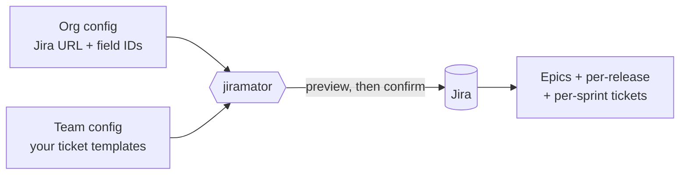

# Jiramator

**Create all your recurring Jira tickets for a Program Increment in one command,
instead of typing them in by hand.**

Every PI, teams hand-create dozens of near-identical Jira tickets: regression
tests per release, prod-support tickets per sprint, the same epics every time.
Jiramator does that for you. You describe the tickets **once** in a config file,
and Jiramator stamps out the full set — correctly linked to epics, fix versions,
and sprints — after showing you a preview first.



**Who it's for:** product owners, scrum masters, and tech leads who run PI
planning. You do not need to be a programmer, but the first-time setup does
involve editing a config file and creating a Jira API token — see
[Quick Start](#quick-start). If that feels daunting, ask a developer on your team
to help with the one-time setup; after that, running it each PI is a single
command.

**Three things it can do:**

| Command | What it does |
|---|---|
| `plan` | Generate a whole PI's worth of epics + per-release + per-sprint tickets from templates |
| `import` | Create Jira issues in bulk from a CSV/Excel spreadsheet (e.g. risk intake) |
| `update` | Bulk-edit fields on existing Jira issues from a CSV/Excel spreadsheet |

Everything runs **preview-first**: `--dry-run` shows exactly what would happen and
touches nothing in Jira until you confirm.

> **Looking for the full config schema, template syntax, or exact flag/safety
> behavior?** That level of detail lives in the
> **[wiki](https://github.com/dkim_mktx/jiramator/wiki)**, so this README stays
> quick to scan. **Contributing to Jiramator itself?** See
> [CONTRIBUTING.md](CONTRIBUTING.md) for the developer setup and test suite.

## Quick Start

### 1. Install

**Prerequisites:**
- Python 3.11 or newer ([python.org/downloads](https://www.python.org/downloads/)).
  Check with `python3 --version` (Windows: `py --version`).
- Git ([git-scm.com/downloads](https://git-scm.com/downloads)). If you'd rather
  not install Git, click the green **Code → Download ZIP** button on the
  [GitHub repo page](https://github.com/dkim_mktx/jiramator) instead, then
  extract it and open a terminal in that folder.

```bash
# macOS / Linux
git clone https://github.com/dkim_mktx/jiramator.git
cd jiramator

# Create and activate a virtual environment (keeps Jiramator's dependencies
# isolated, and avoids "externally-managed-environment" pip errors some
# systems now enforce)
python3 -m venv .venv
source .venv/bin/activate

# Install
pip install -e .

# Verify it worked
jiramator --version
```

```powershell
# Windows PowerShell
git clone https://github.com/dkim_mktx/jiramator.git
cd jiramator

py -m venv .venv
.venv\Scripts\Activate.ps1

pip install -e .

jiramator --version
```

`jiramator --version` should print `jiramator, version 1.0.0` (or newer). If
you instead see `command not found` / `'jiramator' is not recognized`, the
virtual environment likely isn't activated — re-run the `activate` line above
(it's shell/session-specific, so you'll need to run it again each time you
open a new terminal).

### 2. Set credentials

Jiramator reads Jira credentials from environment variables (never from config
files, so your token is never committed to git). The default variable names are
`JIRA_EMAIL` and `JIRA_TOKEN` — these can be overridden per-org in the org config.

Create a Jira API token at
**[id.atlassian.com/manage-profile/security/api-tokens](https://id.atlassian.com/manage-profile/security/api-tokens)**
("Create API token"), then set the two variables:

```bash
# macOS / Linux
export JIRA_EMAIL="you@company.com"
export JIRA_TOKEN="your-jira-api-token"
```

```powershell
# Windows PowerShell (current session only)
$env:JIRA_EMAIL = "you@company.com"
$env:JIRA_TOKEN = "your-jira-api-token"
```

Credentials aren't needed to preview: `plan --dry-run` and `import --dry-run`
never read them, so you can try those out before you ever create a token.
`update --dry-run` is the one exception — it still needs valid credentials
and live Jira access, because it fetches field metadata to preview how your
spreadsheet values will be coerced.

### 3. Configure your org and team

Jiramator splits configuration into two files:

- **Org config** (`configs/org/`) — one per company: your Jira URL, custom
  field IDs, sprint cadence. Shared across all teams.
- **Team config** (`configs/teams/`) — one per team: your Jira project key,
  team name, and the epic/ticket templates that get stamped out each PI.

Both directories are gitignored, so once you copy real configs in, they stay
local to your machine and are never committed.

```bash
mkdir -p configs/org configs/teams
cp configs/org.example/example.yaml     configs/org/mycompany.yaml
cp configs/teams.example/example.yaml   configs/teams/myteam.yaml
```

Two org examples ship in `configs/org.example/`: `example.yaml` is a minimal
starting point, and `marketaxess.yaml` is a fuller, production-shaped
reference — use whichever is closer to your own setup.

**Editing your org config** — at minimum, set:
- `jira_url` — your Jira instance's base URL
- `custom_fields` — map logical names to your instance's custom field IDs
  (find these via Jira admin, or `GET /rest/api/3/field`)
- `sprints.count` / `sprints.standard_length_weeks` / `sprints.long_length_weeks`
  — your PI's sprint cadence

**Editing your team config** — at minimum, set:
- `project_key` — your Jira project key (e.g. `CA`)
- `team_name` — used in generated ticket summaries
- `recurring_epics` / `per_release_tickets` / `per_sprint_tickets` — your
  team's actual ticket templates (copy the examples and adjust field values
  and Jira custom field IDs to match your project)

Once both files are edited, validate them with a dry run before touching Jira:

```bash
jiramator plan --dry-run
```

(If `configs/org/` and `configs/teams/` each contain exactly one file, both
`--org-config` and `--team-config` can be omitted, as above.)

📖 **For the complete config schema** — every field, epic/ticket template
syntax, reusing existing epics, team-wide defaults, and sprint assignment —
see the **[Config Reference wiki page](https://github.com/dkim_mktx/jiramator/wiki/Config-Reference)**.

## The Three Ways to Use Jiramator

### 1. PI Planning (`plan`)

Generates a full PI's worth of epics, per-release tickets, and per-sprint
tickets from your team config's templates.

```bash
jiramator plan --dry-run   # preview — creates nothing
jiramator plan             # live — creates epics, then tickets, in Jira
```

`plan` walks you through an interactive flow: enter the PI number, enter each
release's fix version, confirm sprint status, review a preview table, then
confirm before anything is created. See the
**[Config Reference](https://github.com/dkim_mktx/jiramator/wiki/Config-Reference)**
wiki page for how to define your team's epics and ticket templates.

### 2. Mass Ticket Creation (`import`)

Creates Jira issues in bulk from a spreadsheet — e.g. risk intake, ad-hoc
backlog seeding, anything that isn't a recurring PI template.

A ready-to-edit example spreadsheet is included at
[`docs/samples/mass-creation-sample.xlsx`](docs/samples/mass-creation-sample.xlsx).
Copy it, replace the sample rows with your own, and point `import` at your copy:

```bash
jiramator import --dry-run ~/my-tickets.xlsx   # preview — creates nothing
jiramator import ~/my-tickets.xlsx             # live — creates issues row by row
```

Column headers in the spreadsheet are mapped to Jira fields via your org
config's `bulk_create.field_aliases` — the sample file's headers (`Summary`,
`Issue Type`, `Priority`, `Labels`, `Fix Version`, `Reporter`, etc.) already
match the shipped example org config.

### 3. Mass Ticket Updating (`update`)

Bulk-edits fields on **existing** Jira issues from a spreadsheet. Requires a
`Key` column with real Jira issue keys; blank cells mean "no change."

A ready-to-edit example spreadsheet is included at
[`docs/samples/mass-update-sample.xlsx`](docs/samples/mass-update-sample.xlsx).
Copy it, fill in real issue keys and the fields you want to change, and run:

```bash
jiramator update --dry-run ~/my-updates.xlsx   # preview — changes nothing
jiramator update ~/my-updates.xlsx             # live — updates issues row by row
```

> Unlike `plan`/`import`, `update --dry-run` still requires valid Jira
> credentials and network access — it fetches field metadata from Jira to
> preview coercion. It changes nothing, but it isn't credential-free.

📖 **For the full flag reference and safety model** for both `import` and
`update` — column resolution order, value coercion rules, duplicate handling,
dry-run limitations, and run reports/resuming — see the
**[Import and Update Details](https://github.com/dkim_mktx/jiramator/wiki/Import-and-Update-Details)**
and **[Run Reports and Resuming](https://github.com/dkim_mktx/jiramator/wiki/Run-Reports-and-Resuming)**
wiki pages.

## Getting Help

- Full reference docs (config schema, template syntax, flags, safety model):
  the **[wiki](https://github.com/dkim_mktx/jiramator/wiki)**.
- Something not working as documented? Open a
  [GitHub issue](https://github.com/dkim_mktx/jiramator/issues).
- Want to add a feature or fix something yourself? See
  [CONTRIBUTING.md](CONTRIBUTING.md) for the developer setup and test suite.

## License

MIT
