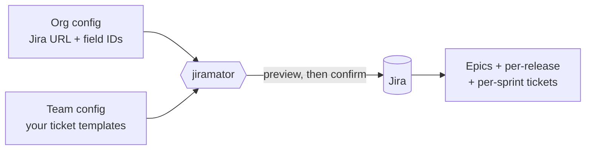

# Jiramator

**Create all your recurring Jira tickets for a Program Increment in one command,
instead of typing them in by hand.**

Every PI, teams hand-create dozens of near-identical Jira tickets: regression
tests per release, prod-support tickets per sprint, the same epics every time.
Jiramator does that for you. You describe the tickets **once** in a config file,
and Jiramator stamps out the full set — correctly linked to epics, fix versions,
and sprints — after showing you a preview first.



**Who it's for:** product owners, scrum masters, and tech leads who run PI
planning. You do not need to be a programmer, but the first-time setup does
involve editing a config file and creating a Jira API token — see
[Quick Start](#quick-start). If that feels daunting, ask a developer on your team
to help with the one-time setup; after that, running it each PI is a single
command.

**Three things it can do:**

| Command | What it does |
|---|---|
| `plan` | Generate a whole PI's worth of epics + per-release + per-sprint tickets from templates |
| `import` | Create Jira issues in bulk from a CSV/Excel spreadsheet (e.g. risk intake) |
| `update` | Bulk-edit fields on existing Jira issues from a CSV/Excel spreadsheet |

Everything runs **preview-first**: `--dry-run` shows exactly what would happen and
touches nothing in Jira until you confirm.

## Quick Start

### 1. Install

**Prerequisites:** Python 3.11 or newer ([python.org/downloads](https://www.python.org/downloads/)).
Check with `python --version`.

```bash
# Clone the repo
git clone <repo-url> && cd jiramator

# Install (editable) with dev deps
pip install -e ".[dev]"
```

This adds a `jiramator` command to your shell.

### 2. Set credentials

Jiramator reads Jira credentials from environment variables (never from config
files, so your token is never committed to git). The default variable names are
`JIRA_EMAIL` and `JIRA_TOKEN` — these can be overridden per-org in the org config.

Create a Jira API token at
**[id.atlassian.com/manage-profile/security/api-tokens](https://id.atlassian.com/manage-profile/security/api-tokens)**
("Create API token"), then set the two variables:

```bash
# macOS / Linux
export JIRA_EMAIL="you@company.com"
export JIRA_TOKEN="your-jira-api-token"
```

```powershell
# Windows PowerShell (current session only)
$env:JIRA_EMAIL = "you@company.com"
$env:JIRA_TOKEN = "your-jira-api-token"
```

Credentials are only needed for **live** runs. `--dry-run` never reads them, so
you can preview a plan before you ever create a token.

### 3. Create config files

Copy the example configs and edit them for your organization and team:

```bash
mkdir -p configs/org
cp configs/org.example/example.yaml  configs/org/mycompany.yaml
cp configs/teams/calcs.yaml          configs/teams/myteam.yaml
```

Two org examples ship in `configs/org.example/`: `example.yaml` is a minimal
starting point, and `marketaxess.yaml` is a fuller, production-shaped
reference (real custom field IDs, a populated `bulk_create` block) — use
whichever is closer to your own setup. `configs/org/` is gitignored, so your
real org config never leaves your machine.

See [Config Reference](#config-reference) below for the full schema.

### 4. Run

```bash
# Dry run — preview what would be created, no API calls
jiramator plan --org-config configs/org/mycompany.yaml \
               --team-config configs/teams/myteam.yaml \
               --dry-run

# Live run — creates tickets in Jira
jiramator plan --org-config configs/org/mycompany.yaml \
               --team-config configs/teams/myteam.yaml
```

The `plan` command walks you through an interactive flow:

1. Prompts for the PI number — accepts `28`, `PI28`, or `pi28` (all become `PI28`)
2. Asks **how many** fix versions this PI has, then prompts for each version
   string one at a time (e.g. `26.1.1`, then `26.1.2`, then `26.2.0`)
3. If the team config has a `board_id`, resolves whether the PI's sprints already
   exist in Jira (from `--sprints-exist/--no-sprints-exist`, the `sprints_exist:`
   config field, or an interactive prompt)
4. Builds the full ticket set and shows a preview table with counts
5. On `--dry-run`, stops here — nothing is created
6. Checks for missing fix versions in Jira and offers to create them
7. Warns that re-running creates duplicates, then asks for confirmation
8. Creates epics first, then bulk-creates the remaining tickets (assigning
   sprints if they were resolved in step 3)
9. Writes a run report to `.jiramator/runs/` (see
   [Run reports & resuming](#run-reports--resuming-a-failed-run))

## Commands

Jiramator ships three CLI workflows:

- `plan` — interactive PI planning for recurring epics, per-release tickets, and per-sprint tickets
- `import` — CSV/XLSX spreadsheet import for ad-hoc issue creation
- `update` — CSV/XLSX spreadsheet bulk-update of existing Jira issues

### `plan`

Use `plan` for recurring, config-driven PI work.

```bash
jiramator plan --org-config configs/org/mycompany.yaml \
               --team-config configs/teams/myteam.yaml \
               --dry-run
```

**Options:**

| Flag | Description |
|---|---|
| `-o, --org-config PATH` | Org config file, or a directory containing exactly one (default: `./configs/org/`) |
| `-t, --team-config PATH` | Team config YAML file (**required**) |
| `-n, --dry-run` | Preview the ticket set and exit without creating anything |
| `--sprints-exist / --no-sprints-exist` | Whether this PI's sprints already exist in Jira. Overrides the `sprints_exist:` config field. `--no-sprints-exist` skips the Jira board lookup entirely |
| `--report PATH` | Where to write the run report (default: `.jiramator/runs/<UTC>-<team>.json`) |
| `--resume [PATH]` | Resume a previous failed/partial run. Bare `--resume` auto-finds the latest for this team; `--resume <path>` targets a specific report |
| `--force` | With `--resume`, skip the config-drift safety check (use only if you understand the duplicate-creation risk) |

### `import`

Use `import` for row-based spreadsheets such as risk-ticket intake.

```bash
# Dry run — parse the spreadsheet, resolve columns, build payloads, print preview
jiramator import --org-config configs/org/mycompany.yaml \
                 --team-config configs/teams/myteam.yaml \
                 --dry-run \
                 ~/Jira.xlsx

# Limit rows during bring-up/debugging
jiramator import --org-config configs/org/mycompany.yaml \
                 --team-config configs/teams/myteam.yaml \
                 --dry-run \
                 --max-rows 10 \
                 --preview-rows 3 \
                 ~/Jira.xlsx

# XLSX with explicit worksheet selection
jiramator import --org-config configs/org/mycompany.yaml \
                 --team-config configs/teams/myteam.yaml \
                 --sheet-name Risks \
                 --dry-run \
                 ~/Jira.xlsx

# Live import — creates issues row by row in the Jira project defined by the team config
jiramator import --org-config configs/org/mycompany.yaml \
                 --team-config configs/teams/myteam.yaml \
                 ~/Jira.xlsx
```

Important:
- The target Jira project is not hardcoded in the application. `import` uses `team_config.project_key` from the selected team config.
- The shipped `configs/teams/calcs.yaml` example happens to target `CA`, but that is configuration, not product logic.
- `spreadsheet_path` is a required positional argument. There is no `--file` flag in the current implementation.
- `--sheet-name` applies only to `.xlsx` imports.

**Options:**

| Flag | Description |
|---|---|
| `-o, --org-config PATH` | Org config file or directory (default: `./configs/org/`) |
| `-t, --team-config PATH` | Team config YAML file (**required** — supplies `project_key`) |
| `-n, --dry-run` | Preview payloads and exit without creating issues |
| `--sheet-name NAME` | Worksheet name for `.xlsx` inputs (defaults to the first sheet) |
| `--max-rows N` | Read at most `N` spreadsheet rows (handy during bring-up) |
| `--preview-rows N` | How many prepared rows to show in the preview (default: 5) |
| `--encoding NAME` | Force a CSV encoding instead of auto-detecting (e.g. `utf-8`, `utf-8-sig`, `cp1252`, `utf-16-le`) |
| `--report PATH` | Where to write the run report (default: `.jiramator/runs/<UTC>-<team>.json`) |
| `--resume [PATH]` | Resume a previous import (bare = auto-find latest; or pass a report path) |
| `--force` | With `--resume`, skip the config-drift check |

### Import behavior and safety model

The import workflow is intentionally conservative:

1. Load org config
2. Load team config
3. Read spreadsheet rows from CSV or XLSX
4. Resolve spreadsheet headers to Jira fields
5. Build Jira payloads row by row
6. In dry-run mode, print only the preview report
7. In live mode, fetch Jira field metadata, skip duplicates by exact summary within the configured project, then create issues row by row
8. Continue after per-row Jira API failures and report created/skipped/failed rows at the end

This is not an upsert engine. Use the `update` command to modify existing issues.

### Column resolution order

For each spreadsheet header, Jiramator resolves fields in this order:

1. org-config `bulk_create.field_aliases`
2. Jira metadata exact/normalized field-name match, if `bulk_create.auto_lookup_unknown_fields` is enabled
3. unresolved column warning

Preview output reports three categories:
- `mapped_columns` — resolved through config aliases/direct mapping
- `auto_mapped_columns` — resolved through live Jira field metadata
- `skipped_columns` — unresolved columns that were ignored

### Value coercion rules

The importer does not blindly pass spreadsheet strings through to Jira. It coerces values according to configured field types and a small set of built-in standard-field rules.

Examples:
- `issuetype`, `priority` -> `{ "name": value }`
- `fixVersions`, `components` -> `[{ "name": value }]`
- `labels` -> `[value1, value2]`
- single-select custom fields -> `{ "value": value }`
- multi-select custom fields -> `[{ "value": value1 }, { "value": value2 }]`
- rich-text fields configured as `adf_text` -> Atlassian Document Format payloads
- numeric fields configured as `number` -> parsed numeric values

If your Jira instance requires organization-specific coercion rules, encode them in org config rather than hardcoding them in team logic.

### Reporter handling

`Reporter` is treated specially:
- in preview mode, it is recognized and shown as mapped, but not emitted as a raw Jira field payload value
- in live mode, Jiramator resolves the spreadsheet reporter value to a Jira `accountId` before issue creation

This split is deliberate. Preview stays side-effect free; live import performs identity lookup.

### Dry-run limitations

Dry-run is a payload preview, not a server-side Jira validation pass.

That is intentional. In this environment, using Jira create with `validateOnly=true` was observed to create a real issue unexpectedly, so Jiramator does not rely on Jira-side dry-run semantics as a safety boundary.

What dry-run does guarantee:
- spreadsheet parsing works
- header resolution works
- payload construction works
- row-level warnings/errors are visible before creation

What dry-run does not guarantee:
- Jira will accept every payload at create time
- reporter/account lookups will succeed later
- field-option values are valid in the target project context

### Duplicate handling

Before live creation, Jiramator queries Jira for existing issues with matching summaries in the configured project and skips exact-summary duplicates.

This is a safety feature, not a perfect dedupe system. If two distinct issues legitimately share a summary, the current workflow will treat them as duplicates.

### `update`

Use `update` to bulk-modify fields on existing Jira issues.

```bash
# Dry run — resolve columns, build payloads, print preview, no Jira writes
jiramator update --org-config configs/org/mycompany.yaml \
                 --dry-run \
                 ~/updates.xlsx

# Live run — update issues row by row
jiramator update --org-config configs/org/mycompany.yaml \
                 ~/updates.xlsx

# Custom key column (default is 'Key')
jiramator update --org-config configs/org/mycompany.yaml \
                 --key-column "Issue Key" \
                 ~/updates.xlsx

# XLSX with explicit worksheet selection
jiramator update --org-config configs/org/mycompany.yaml \
                 --sheet-name Sheet2 \
                 --dry-run \
                 ~/updates.xlsx
```

Important:
- The spreadsheet **must** have a key column (default: `Key`) containing Jira issue keys (e.g. `CA-4646`).
- All other columns are resolved to Jira fields via the same org config alias/metadata lookup used by `import`.
- Blank and whitespace-only cells mean **no change** — they are omitted from the payload and will **not** clear the existing Jira field value.
- Duplicate issue keys in the spreadsheet are rejected before any update; one row must correspond to exactly one issue.
- Rows where all non-key columns are blank are silently skipped as no-ops.
- `--team-config` is **not** required; `update` only needs the org config for field aliases and Jira credentials.

### Update behavior and safety model

1. Load org config
2. Read spreadsheet rows from CSV or XLSX
3. Check for duplicate Jira keys — fail fast if any are found
4. In dry-run mode, fetch Jira field metadata, build payloads, and print a preview
5. In live mode, build payloads and update issues one by one via `PUT /rest/api/3/issue/{key}`
6. Continue after per-row API failures; report updated/skipped/failed rows at the end
7. Write a JSON run report to `.jiramator/runs/<UTC>-<spreadsheet>.json` (override with `--report`)

The update command does not apply `bulk_create.defaults` from the org config, because those defaults often contain create-only fields (e.g. `issuetype: Risk`) that Jira rejects on update.

### Run reports & resuming a failed run

Every **live** run of `plan`, `import`, and `update` writes a JSON run report to
`.jiramator/runs/<UTC>-<name>.json` (override the location with `--report`). The
report records exactly which issues were created, skipped, or failed — a durable
audit trail, written incrementally so it survives a crash or Ctrl-C.

If a run fails partway through (a network blip, one bad row, an auth expiry),
`plan` and `import` let you pick up where you left off:

```bash
# Auto-find and resume the most recent failed/partial run for this team config
jiramator plan -t configs/teams/myteam.yaml --resume

# Or resume a specific report
jiramator import -t configs/teams/myteam.yaml --resume .jiramator/runs/2026-...json ~/Jira.xlsx
```

Issues already created in the prior run are **skipped**, so resuming never
double-creates them.

**Drift protection:** resume first compares a hash of the resolved config and
inputs against the prior run. If they differ — because you edited templates,
changed the versions, or renamed an epic ref — resume refuses and asks you to
either start fresh or pass `--force`. This prevents silently creating duplicates
when the meaning of a template has changed. Use `--force` only when you're sure
the change is safe.

> `update` writes a run report as well, but does not currently support
> `--resume`; re-run it against the same spreadsheet (blank cells are no-ops, so
> re-running is safe for rows that already succeeded).

### Current scope vs future work

Shipped today:
- `plan`, `import`, and `update` commands
- Run reports + `--resume` with config-drift protection (`plan`, `import`)
- Template inheritance (org `default_fields` → team `defaults` → template `fields`)
- Sprint assignment for `plan` (via `board_id` + `sprint_name_template`)
- Pre-existing epic reuse (`existing_epics`) and release→sprint mapping
- CSV encoding auto-detection with `--encoding` override

Still future work:
- YAML-based ad-hoc bulk creation CLI
- An interactive `setup` wizard for first-time config generation
- broader README examples and operational playbooks

Planning/spec artifacts now live under `.planning/specs/`.
See `.planning/specs/README.md` for the canonical index and document statuses.

---

## Config Reference

Jiramator uses a two-tier configuration model:

- **Org config** — shared across all teams at a company (Jira URL, custom field
  IDs, sprint cadence)
- **Team config** — specific to one team (project key, epic definitions, ticket
  templates)

### Org Config

| Field | Type | Required | Description |
|-------|------|----------|-------------|
| `jira_url` | string | **yes** | Base URL of your Jira instance |
| `jira_email_env` | string | no | Env var name for email (default: `JIRA_EMAIL`) |
| `jira_token_env` | string | no | Env var name for API token (default: `JIRA_TOKEN`) |
| `custom_fields` | map | no | Mapping of logical names → Jira custom field IDs (needed if your templates reference logical names or use sprint assignment) |
| `default_fields` | map | no | Fields **locked** onto every issue created by `plan` under any team in this org. Same-name keys in team `defaults` or template `fields` are warned and dropped at load time. Not applied by `import`. |
| `bulk_create.field_aliases` | map | no | Spreadsheet/import header aliases → logical or Jira field names |
| `bulk_create.field_types` | map | no | Coercion rules for logical or Jira field names |
| `bulk_create.defaults` | map | no | Default field values gap-filled during `import` (only when the field isn't already set) |
| `bulk_create.auto_lookup_unknown_fields` | bool | no | Whether import may use Jira field metadata to resolve unknown headers |
| `bulk_create.multi_value_delimiter` | string | no | Delimiter for parsing multi-value spreadsheet cells |
| `sprints.count` | int | **yes** | Number of sprints per PI |
| `sprints.standard_length_weeks` | int | **yes** | Length of standard sprints in weeks |
| `sprints.long_length_weeks` | int | **yes** | Length of extended sprints in weeks |
| `sprints.long_sprints` | list[int] | no | Which sprint numbers are long (1-indexed) |

> **Sprint field:** the Jira custom field used to assign a sprint defaults to
> `customfield_10021`. If your instance differs, add `sprint_field:
> customfield_XXXXX` under `custom_fields`.

**Example** (`configs/org.example/example.yaml`):

```yaml
jira_url: https://example.atlassian.net

jira_email_env: JIRA_EMAIL
jira_token_env: JIRA_TOKEN

custom_fields:
  story_points: customfield_10026
  epic_link: customfield_10014
  api_impact: customfield_10273

bulk_create:
  field_aliases:
    Summary: summary
    Issue Type: issuetype
    API Impact: api_impact
    Reporter: reporter
  field_types:
    issuetype: name_object
    api_impact: multi_select
    risk_description: adf_text
    overall_risk_value: number
  defaults:
    issuetype: Risk
    api_impact: No
  auto_lookup_unknown_fields: true
  multi_value_delimiter: ","

sprints:
  count: 6
  standard_length_weeks: 2
  long_length_weeks: 3
  long_sprints: [6]
```

For a fuller, production-shaped reference — real custom field IDs and a
populated `bulk_create` block for a risk-intake spreadsheet — see
`configs/org.example/marketaxess.yaml`. Both examples are gitignore-free
(shipped in the repo); only your copy under `configs/org/` is local-only.

### Team Config

| Field | Type | Required | Description |
|-------|------|----------|-------------|
| `project_key` | string | **yes** | Jira project key (e.g. `CA`) |
| `team_name` | string | **yes** | Team display name, available as `{team_name}` |
| `board_id` | int/null | no | Jira board ID for sprint assignment (null to skip) |
| `sprint_name_template` | string/null | no | Pattern to match sprints (e.g. `"CA Sprint {pi_num}.{sprint_num}"`) |
| `sprints_exist` | bool/null | no | Whether this PI's sprints already exist in Jira. `null` = ask interactively (or error on non-TTY); `true` = resolve sprints; `false` = skip the board lookup. Overridden by `--sprints-exist/--no-sprints-exist`. |
| `defaults.fields` | map | no | Team-wide fields merged into **every** template (epics + tickets) in this config. Locked — same-name keys in a template's `fields` are warned and dropped. |
| `existing_epics` | map | no | Reuse epics that already exist instead of creating them: `ref_key → Jira key` (e.g. `{bau: CA-1234}`). Referenced the same way as `recurring_epics` via `$epic:<ref_key>`. |
| `release_sprint_map` | map | no | Assign per-release tickets to sprints: `version → {sprint_group: sprint_number}` (used with a template's `sprint_group`). |
| `recurring_epics` | list | no | Epics created fresh at the start of each PI |
| `per_release_tickets` | list | no | Tickets generated once per release version |
| `per_sprint_tickets` | list | no | Tickets generated once per sprint |

A given epic `ref_key` may appear in **either** `recurring_epics` or
`existing_epics`, never both.

#### Epic Template

```yaml
recurring_epics:
  - key: bau                                      # internal ref key
    summary: "{team_name} {pi_label} - BAU Work"  # template string
    fields:                                        # optional extra Jira fields for the epic itself
      customfield_11623: {value: ["Internal Initiative"]}
      customfield_10214: {value: "Business Feature"}
      customfield_11560: {value: "M"}
      customfield_10237: {value: "High"}
      customfield_13209: {value: "Firm Strategic"}
```

The `key` is used in ticket templates to link tickets to this epic via
`$epic:<key>` syntax (see [Epic References](#epic-references)). Epic `fields`
work the same way as ticket `fields`: standard Jira fields are wrapped as
needed, and `customfield_*` values are passed through as raw JSON.

> To **reuse** epics that already exist in Jira rather than creating new ones,
> use [`existing_epics`](#reusing-existing-epics) instead of `recurring_epics`.

#### Ticket Template

```yaml
per_release_tickets:
  - summary: "Testing - {version} Pre-regression test"
    sprint_group: "pre"                # optional: see "Assigning ... to sprints"
    fields:
      issuetype: Task
      priority: Medium
      labels: ["{pi_label}", "Testing"]
      fixVersions: ["{version}"]
      customfield_10026: 0.5          # story points
      customfield_10014: "$epic:misc"  # epic link
```

#### Per-Sprint Ticket with Long Sprint Handling

```yaml
per_sprint_tickets:
  - summary: "Misc - Prod Support (Sprint {sprint_num})"
    fields:
      issuetype: Task
      priority: Medium
      labels: ["{pi_label}", "Prod_Support"]
      fixVersions: ["{pi_label}"]
      customfield_10026: 2.0
      customfield_10014: "$epic:misc"
    extra_on_long_sprint: 1             # create 1 extra ticket on long sprints
    long_sprint_suffix: ["a", "b"]      # suffixes for {sprint_num}: "6a", "6b"
```

For a 6-sprint PI where sprint 6 is long, this produces:
- Sprints 1–5: one ticket each (`Sprint 1`, `Sprint 2`, ... `Sprint 5`)
- Sprint 6: two tickets (`Sprint 6a`, `Sprint 6b`)

#### Reusing existing epics

Many teams keep the *same* epics across PIs (or create them by hand). Instead of
listing them under `recurring_epics` (which creates new ones), map each ref key
to the real Jira issue key under `existing_epics`:

```yaml
existing_epics:
  bau:  CA-4829
  misc: CA-4830

recurring_epics: []   # nothing to create — reuse the keys above
```

`$epic:bau` / `$epic:misc` in ticket templates resolve to those keys exactly as
if they had been created this run. A ref key may live in `recurring_epics` **or**
`existing_epics`, but not both.

#### Team defaults (shared fields)

If every ticket in a team config needs the same field (say a fixed API-impact
value), declare it once under `defaults.fields` instead of repeating it in every
template:

```yaml
defaults:
  fields:
    customfield_10273: [{value: "No"}]   # applied to every epic + ticket

per_release_tickets:
  - summary: "Testing - {version} Pre-regression test"
    fields:
      issuetype: Task                     # customfield_10273 is inherited
```

Team defaults are **locked**: if a template also sets the same field, Jiramator
prints a warning and keeps the default. (Org-level `default_fields` lock across
*all* teams in the same way, and win over team defaults.)

#### Assigning per-release tickets to sprints

Per-release tickets don't have a natural sprint number. To place them, tag a
template with a `sprint_group` and map each version's groups to sprint numbers in
`release_sprint_map`:

```yaml
release_sprint_map:
  "26.2.1": { pre: 2, post: 3 }
  "26.2.2": { pre: 4, post: 5 }

per_release_tickets:
  - summary: "Testing - {version} Pre-regression test"
    sprint_group: "pre"     # 26.2.1 → sprint 2, 26.2.2 → sprint 4, ...
    fields: { issuetype: Task, fixVersions: ["{version}"] }
```

Sprint assignment only happens on live runs when `board_id` and
`sprint_name_template` are set and the sprints already exist (see the
[`plan` flow](#quick-start)).

## Template Variable Reference

| Variable | Available In | Example Value | Description |
|----------|-------------|---------------|-------------|
| `{pi_label}` | epics, all tickets | `PI28` | `"PI" + pi_num` |
| `{pi_num}` | epics, all tickets | `28` | The PI number entered at runtime |
| `{version}` | per_release only | `26.1.1` | The release version string |
| `{sprint_num}` | per_sprint only | `1`, `6a` | Sprint number (with suffix for long sprints) |
| `{team_name}` | epics, all tickets | `Calcs` | From team config `team_name` field |

Variables can appear in `summary` and in any string value within `fields`.
Numeric field values (e.g. `customfield_10026: 0.5`) are passed through as-is.

## Epic References

Use `$epic:<key>` in any field value to reference an epic defined in
`recurring_epics`.  The ticket builder resolves these to actual Jira issue keys
after the epics are created.

```yaml
customfield_10014: "$epic:misc"   # → resolved to e.g. "CA-1234"
```

In dry-run mode, epic references are left as the literal string `$epic:misc`.

## Field Type Mapping

Jiramator automatically wraps field values into the JSON structures Jira expects.
You write simple values in your config; the builder handles the rest.

| Config Value | Jira API Payload | Fields |
|-------------|-----------------|--------|
| `"Task"` | `{"name": "Task"}` | `issuetype`, `priority` |
| `["26.1.1"]` | `[{"name": "26.1.1"}]` | `fixVersions`, `components` |
| `["PI28", "Testing"]` | `["PI28", "Testing"]` | `labels` (no wrapping) |
| `0.5` | `0.5` | `customfield_*` (pass-through) |
| `"$epic:misc"` | `"CA-1234"` | `customfield_*` (resolved) |

## Creating Custom Team Configs

1. **Start from an example:** Copy `configs/teams/calcs.yaml` as a starting
   point.

2. **Set your project key and team name:** These are the only required team-level routing fields. Jiramator sends issues to the Jira project named by `team_config.project_key`; it does not hardcode a project like `CA` in application logic.

3. **Define your epics:** List the recurring epics your team creates each PI.
   Give each a unique `key` for cross-referencing.

4. **Define per-release tickets:** Templates that get stamped out once for each
   release version.  Use `{version}` in summaries and fix versions.

5. **Define per-sprint tickets:** Templates stamped out once per sprint.  Use
   `{sprint_num}`.  For long sprints, add `extra_on_long_sprint` and
   `long_sprint_suffix` to generate split tickets.

6. **Look up custom field IDs:** Use the Jira REST API to find your instance's
   custom field IDs:
   ```
   GET /rest/api/3/field
   ```
   Map the logical names in your org config, then reference the field IDs
   directly in team ticket templates.

7. **Validate:** Run with `--dry-run` to see the full ticket set before touching
   Jira.

## Running Tests

```bash
pip install -e ".[dev]"
python -m pytest -v
```

Run the full suite after changing config, import, coercion, or Jira client behavior.
The exact test count will change over time; rely on pytest output rather than this README for a hard number.

Continuous integration runs the same suite on every push and pull request across
Linux, macOS, and Windows (Python 3.11–3.13) via
[`.github/workflows/ci.yml`](.github/workflows/ci.yml).

## Future Enhancements

- **`setup` subcommand** — Interactive wizard to generate org and team config
  files step by step (a big win for non-technical first-time setup).
- **Field-discovery helper** — A command to list/search your Jira instance's
  custom field IDs so you don't have to hand-map them from the REST API.
- **MCP server** — Drive `plan`/`import`/`update` from an AI assistant
  (Copilot, Claude) in natural language, removing the CLI/YAML barrier. See the
  design proposal in [`docs/mcp-server-proposal.md`](docs/mcp-server-proposal.md).
- **Duplicate detection for `plan`** — Query Jira for existing tickets matching
  summary + PI label before creating, and skip them automatically. (`import`
  already skips exact-summary duplicates; `plan` does not.)
- **`--yes` flag** — Skip confirmation prompts for scripted/CI usage.
- **Sub-task support** — Allow `type: Sub-task` with a `parent` field linking to
  a parent issue (not just epic linking).

## License

MIT
