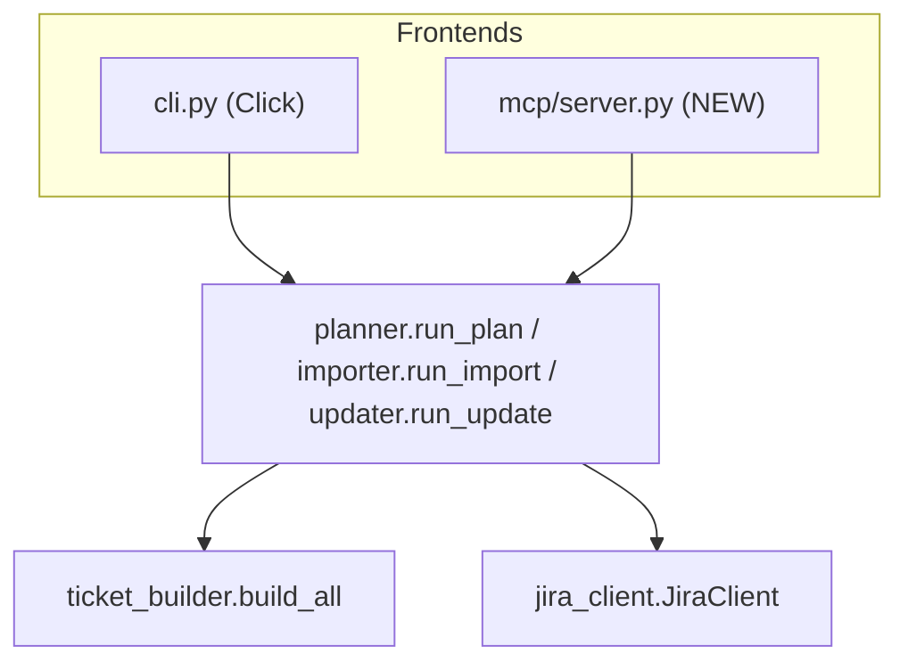

# Proposal: A Jiramator MCP Server

**Status:** Reviewed — **Declined / deprioritized** (2026-07-10)
**Author:** Jiramator maintainers
**Audience:** Anyone deciding whether/how to expose Jiramator to non-technical
users; engineers who would build it.

---

> **Review outcome (2026-07-10):** This proposal was reviewed and **not adopted
> as the primary accessibility path**. An MCP server is well-engineered but does
> not remove the real on-ramp barriers (installing Python, minting a Jira token,
> hand-editing YAML with raw custom-field IDs) — to use MCP a user needs all of
> those *plus* an MCP client. The barriers were instead addressed directly by:
> (1) the `jiramator init` setup wizard (auto-discovers field IDs, writes
> config), and (2) the non-interactive planner refactor (`--pi-number` /
> `--versions` / `--yes`). This document is retained as a design artifact; the
> salvaged non-interactive core shipped in v1.0.1 and the wizard in v1.1.0.
>
> _Correction:_ an earlier draft of this proposal cited a
> `.planning/PROJECT.md` line stating "MCP is the preferred primary API path."
> That file and quote do not exist; the actual motivation traces to
> `REQUIREMENTS.md` (INTG-01), and `.planning/research/PITFALLS.md` in fact
> **warns against** treating MCP as the primary path.

---

## TL;DR

Add a small **MCP server** that wraps Jiramator's existing `plan`, `import`, and
`update` flows as a handful of tools. This lets people drive Jiramator from an AI
assistant (GitHub Copilot, Claude) in plain English — *"Plan PI 29 for the Calcs
team with versions 26.2.1 and 26.2.2"* — instead of learning a CLI and hand-editing
YAML. It reuses the engine we already have, keeps Jiramator's **dry-run-first**
safety model, and requires no new Jira logic. The `import` and `update` cores are
already non-interactive and essentially MCP-ready; only `plan` needs a small,
well-contained refactor.

This direction was originally motivated by `REQUIREMENTS.md` (INTG-01, exposing
plan/import as MCP tools). **Note:** see the review-outcome banner at the top of
this document — this path was ultimately declined in favor of the setup wizard
and non-interactive CLI.

---

## 1. Why do this?

Jiramator's engine is solid, but the **on-ramp is the barrier** for a company-wide
audience:

- You must hand-edit YAML that contains raw Jira custom-field IDs.
- You must set environment variables and mint an API token.
- You must have Python, `pip`, and comfort with a terminal.

Non-technical POs and scrum masters — exactly the people this tool is meant to
serve — stall on that setup. An MCP server removes most of it. The assistant
becomes the interactive front-end: it asks the clarifying questions, calls the
right tool, shows the preview, and asks for confirmation before anything is
written to Jira.

### What is MCP, in one paragraph?

The **Model Context Protocol** is an open standard that lets an AI assistant call
external "tools" (functions) that a server exposes. You register the server once in
your assistant's config; from then on the assistant can invoke Jiramator's tools on
your behalf, passing structured arguments and getting structured results back. It's
the same idea as a plugin, standardized so it works across Copilot, Claude, and
other MCP-aware clients.

---

## 2. Goals and non-goals

**Goals**
- Let users run plan / import / update via natural language, no CLI required.
- Preserve the **preview-before-write** safety guarantee that makes Jiramator safe.
- Reuse the existing engine (`planner`, `importer`, `updater`, `jira_client`) —
  no duplicated Jira logic.
- Keep credentials in environment variables (never in tool arguments or chat).

**Non-goals (for v1)**
- Not a hosted/multi-tenant service — start with a **local stdio server** per user.
- Not a config editor — writing team YAML is a separate future "setup wizard."
- Not a replacement for the CLI — the CLI remains fully supported; MCP sits beside it.

---

## 3. What the experience looks like

> **User:** Plan PI 29 for the Calcs team. Versions are 26.2.1 and 26.2.2, and the
> sprints already exist.
>
> **Assistant:** *(calls `preview_plan`)* Here's what I'll create in project **CA**
> — 0 new epics (reusing CA-4829/CA-4830), 12 per-release tickets, 7 per-sprint
> tickets = **19 total**. Want me to create them?
>
> **User:** Yes, go ahead.
>
> **Assistant:** *(calls `create_plan` with the token from the preview)* Done —
> created 19 issues. Run report saved as `.jiramator/runs/2025…-plan.json`. One
> ticket failed validation; want me to resume just that one?

The assistant handles the "how many versions?" style questions that the CLI asks
interactively. Jiramator still does the real work and still refuses to write
anything until the user confirms.

---

## 4. Where it fits in the architecture

The MCP server is a **new, thin sixth layer** that sits *beside* the CLI. Both are
just front-ends onto the same orchestration functions. No business logic moves into
the MCP layer.



Design rule to hold the line: **the MCP layer contains no Jira knowledge.** It
parses tool arguments, calls an orchestration function, and formats the result —
exactly the role `cli.py` plays today.

---

## 5. Proposed tool surface

The tools mirror the three commands, each split into a **preview** (read-only) and
a **create/apply** (writes to Jira) tool. Splitting them — rather than a single tool
with a `dry_run` flag — makes the destructive step explicit and easy for an
assistant to gate behind user confirmation.

| Tool | Writes to Jira? | Purpose |
|---|---|---|
| `list_teams` | no | List available team configs by name (discovery). |
| `describe_team` | no | Plain-language summary of a team's epics & ticket templates. |
| `preview_plan` | no | Build the full ticket set for a PI and return counts + a sample. |
| `create_plan` | **yes** | Create the previewed plan. Requires a `preview_token`. |
| `preview_import` | no | Validate a spreadsheet and return a per-row preview. |
| `create_import` | **yes** | Create issues from the spreadsheet. Requires a `preview_token`. |
| `preview_update` | no | Show which issues/fields would change. |
| `apply_update` | **yes** | Apply the updates. Requires a `preview_token`. |
| `list_run_reports` | no | List recent runs from `.jiramator/runs/`. |
| `resume_run` | **yes** | Resume a failed run from its report (reuses existing resume logic). |

### The `preview_token` confirmation pattern

Every `preview_*` tool returns a short **`preview_token`** derived from the resolved
config (Jiramator already computes this — `run_report.compute_resolved_hash`). The
matching `create_*`/`apply_*` tool **requires** that token. This gives two
protections for free:

1. The assistant physically cannot create tickets without having first run a
   preview (so the user always sees what's coming).
2. If the config changed between preview and create, the token won't match and the
   write is refused — the same **drift detection** the CLI already enforces via
   `ConfigDriftError`.

### Example tool schemas

```jsonc
// preview_plan (read-only)
{
  "name": "preview_plan",
  "inputs": {
    "team": "calcs",                 // team config name (from list_teams)
    "pi_number": "29",
    "versions": ["26.2.1", "26.2.2"],
    "sprints_exist": true             // optional; omit to let the assistant ask
  },
  "returns": {
    "project_key": "CA",
    "counts": { "epics": 0, "per_release": 12, "per_sprint": 7, "total": 19 },
    "sample": [ /* first few rendered ticket summaries */ ],
    "warnings": [ /* e.g. locked-field overrides */ ],
    "preview_token": "sha256:1a2b…"
  }
}

// create_plan (writes) — must echo the token from preview_plan
{
  "name": "create_plan",
  "inputs": {
    "team": "calcs", "pi_number": "29",
    "versions": ["26.2.1", "26.2.2"], "sprints_exist": true,
    "preview_token": "sha256:1a2b…"
  },
  "returns": {
    "status": "completed",           // or "partial" / "failed"
    "created": 19, "failed": 0,
    "report_path": ".jiramator/runs/2025…-plan.json"
  }
}
```

`import`/`update` tools follow the same shape, taking a spreadsheet path (or a small
inline table) instead of PI inputs.

---

## 6. The one real refactor: making `plan` non-interactive

`run_import` and `run_update` are **already** callable non-interactively — they take
rows plus flags and return a result object with a `.preview` (see `cli.py`, which
calls `run_import(..., dry_run=True)` and prints `result.preview`). Wrapping them as
MCP tools is mostly argument marshalling.

`run_plan` is different: it collects its inputs through **Rich prompts**
(`_prompt_pi_number`, `_prompt_fix_versions`, `_prompt_sprints_exist`) and asks for
confirmation mid-flow. An MCP tool can't answer a terminal prompt.

**Recommended fix (small, contained):** separate *input collection* from *execution*.

- Extract a pure core, e.g. `plan_preview(org, team, PlanInputs) -> Preview` and
  `plan_execute(org, team, PlanInputs, client) -> Result`, where `PlanInputs`
  carries `pi_number`, `versions`, and `sprints_exist` explicitly.
- The **CLI** keeps its Rich prompts, but they now just *populate `PlanInputs`* and
  call the core — no behavior change for existing users.
- The **MCP** layer populates `PlanInputs` straight from tool arguments.

This is a healthy change regardless of MCP: it pushes interactive I/O out to the
edges and leaves `planner` as pure orchestration, consistent with the project's
existing five-layer separation-of-concerns rule.

---

## 7. Credentials and configuration

- **Credentials stay in environment variables** (`JIRA_EMAIL`, `JIRA_TOKEN`, or the
  per-org overrides). The MCP client config supplies them to the server process via
  its `env` block; they are never passed as tool arguments and never appear in chat.
- **Config discovery:** the server reads org config from `configs/org/` and team
  configs from `configs/teams/` (same defaults as the CLI), overridable by an env
  var such as `JIRAMATOR_CONFIG_DIR`. `list_teams` enumerates what's available so the
  assistant can offer choices.

Example MCP client registration (Claude Desktop / Copilot style):

```jsonc
{
  "mcpServers": {
    "jiramator": {
      "command": "jiramator-mcp",
      "env": {
        "JIRA_EMAIL": "me@company.com",
        "JIRA_TOKEN": "…",
        "JIRAMATOR_CONFIG_DIR": "C:/Users/me/jiramator/configs"
      }
    }
  }
}
```

---

## 8. Transport and packaging

- **Transport:** **stdio** for v1 — the standard for local, single-user MCP servers
  and what Copilot/Claude Desktop expect. A hosted **HTTP/SSE** transport (one shared
  server for the whole company) is a natural Phase 3.
- **Packaging:** add an optional extra and a new entry point so nothing new is forced
  on existing CLI users:

  ```toml
  [project.optional-dependencies]
  mcp = ["mcp>=1.0"]           # official Python MCP SDK

  [project.scripts]
  jiramator      = "jiramator.cli:cli"
  jiramator-mcp  = "jiramator.mcp.server:main"   # NEW
  ```

  Install with `pip install -e ".[mcp]"`. New code lives in a new package
  `jiramator/mcp/` (`server.py` plus thin `tools/` adapters), keeping it isolated
  from the core.

---

## 9. Safety model

The MCP server inherits Jiramator's existing guarantees and adds one:

1. **Preview before write** — enforced structurally by the `preview_*` / `create_*`
   split and the required `preview_token`.
2. **Drift refusal** — a stale token (config changed since preview) is rejected,
   reusing `compute_resolved_hash` / `ConfigDriftError`.
3. **Atomic run reports + resume** — `create_*` tools write the same
   `.jiramator/runs/<UTC>-<name>.json` reports the CLI writes; `resume_run` reuses
   the existing resume path, so a partial failure is recoverable through the
   assistant too.
4. **Least privilege in chat** — no secrets or full Jira payloads echoed back; tool
   results return counts, samples, warnings, and the report path.

---

## 10. Phased implementation plan

| Phase | Scope | Approx. effort |
|---|---|---|
| **1. Read-only** | `list_teams`, `describe_team`, `preview_plan`, `preview_import`, `preview_update`. Includes the `plan_preview` extraction. Zero write paths — safe to dogfood immediately. | ~2–3 days |
| **2. Writes** | `create_plan`, `create_import`, `apply_update`, `resume_run`, `list_run_reports`, with the `preview_token` gate. | ~2–3 days |
| **3. Distribution & polish** | Package the extra + entry point, write user setup docs, optional HTTP transport for a shared server, richer `describe_team` output. | ~2–4 days |

Phase 1 alone is already useful: users can ask *"what would planning PI 29 create?"*
and get a real answer with no risk.

---

## 11. Testing strategy

Follow the existing conventions (`Test<Component>`, `test_<behavior>_<result>`,
mock only the HTTP boundary):

- **Adapter unit tests** — assert each tool marshals arguments into the core call and
  formats results correctly, mocking `run_plan`/`run_import`/`run_update`.
- **Token/drift tests** — `create_*` rejects a missing or stale `preview_token`.
- **Reuse integration fixtures** — point `preview_plan` at the shipped
  `configs/org.example/example.yaml` + `tests/fixtures/teams/calcs.yaml` and assert the same
  counts the current integration suite checks (**0 epics, 18 per-release, 7
  per-sprint = 25** for the shipped 3-version scenario).
- **Protocol smoke test** — start the stdio server, list tools, call one read-only
  tool end-to-end.

---

## 12. Risks and open questions

- **Assistant reliability** — an LLM could mis-transcribe a version string. Mitigation:
  the preview always echoes exactly what will be created, and creation is gated on
  explicit user confirmation.
- **Spreadsheet inputs over MCP** — passing a whole file through chat is awkward.
  Recommendation: tools take a **file path** the server reads locally (matching how
  `import` works today); inline tables only for tiny cases.
- **MCP SDK/version churn** — the ecosystem moves fast; isolating everything under
  `jiramator/mcp/` and behind the `[mcp]` extra contains the blast radius.
- **Open question:** should v1 ship a single shared server for the team (hosted,
  Phase 3) or one local server per user (stdio, Phases 1–2)? Recommendation: **local
  first**, learn from real usage, then decide on hosting.

---

## 13. Recommendation

Build **Phase 1 (read-only)** now. It's low-risk, exercises the one refactor worth
doing anyway (`plan_preview` extraction), and immediately makes Jiramator
approachable for non-technical users — the core goal of sharing it more widely. Add
writes in Phase 2 behind the preview-token gate, then package and document in Phase
3.
